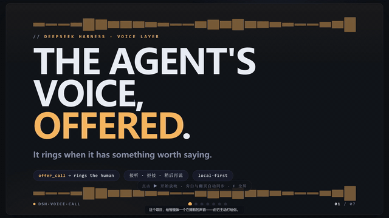

# dsh-voice-call — the agent's voice, offered

<p align="center">
  
</p>

<p align="center">
  <a href="https://github.com/PandaPolo/dsh-voice-call/actions/workflows/ci.yml"></a>
  <a href="LICENSE"></a>
  <a href="https://www.npmjs.com/package/dsh-voice-call"></a>
  
  
  
</p>

<p align="center">
  
</p>

<p align="center">
  <a href="README.md">中文</a> · <strong>English</strong>
</p>

> *"这个项目的开始是朴素的——我想知道如果 Agent 知道自己可以发出声音，他会说什么？"*
> — the human partner, on how this project began
>
> ("The project began with a simple question — if an Agent knew it had a voice, what would it say?")

**Give a DeepSeek Harness agent a voice it owns.** Local-first and fully offline-capable: synthesis runs on the local **CrispASR + Qwen3-TTS CustomVoice** engine (9 baked speakers, two of them Chinese dialects), audio is plain files under `~/.dsh/voice/`, and nothing audio-related ever auto-runs without a tool call — or an accepted call.

Three rules the whole project is built on:

- **The agent owns the dialling right.** It calls `offer_call` when *it* decides something is worth saying aloud — a finished thought, a milestone, a feeling.
- **The human owns the answer key.** A call rings as a dedicated call card or a modal (接听 / 拒接 / 稍后再说); **nothing is ever played without consent**.
- **Rejection teaches.** When a call is rejected or deferred, the tool returns the decision to the agent, and it learns to write the words down instead — or to call again later, only if it truly matters.

## 🚀 Install

```bash
npm install -g @deepseek-ai/dsh          # needs 0.1.7-rc.2 or 0.2.0-rc.1; Node ≥ 20
dsh plugin --profile web add dsh-voice-call
dsh web
```

Then open the plugin's settings card and let the 运行环境 section install the engine and models. Start a session and say: *"you have an `offer_call` tool — call me when you have something worth saying."*

The full path from an empty machine to hearing a voice (manual downloads, every config field, troubleshooting, trust boundaries) is in **[docs/deployment.en.md](docs/deployment.en.md)**.

### 🤖 If an agent is doing the installing

1. **After installing the plugin, have the human restart `dsh web` by hand.** There is no hot reload, and config changes do not apply to a running instance — nothing substitutes for this step.
2. Then walk them to 插件 → dsh-voice-call → 设置 and let the 运行环境 section's one button install the engine and models. Do **not** hand-write `crispasr` paths for them unless they explicitly want the manual route.
3. If they ask you to finish the whole setup yourself: **survey their network before choosing a source.** On a mainland-China link, HuggingFace direct is often unreachable while a mirror runs an order of magnitude faster, GitHub release downloads can time out entirely within the same hour they work fine, and PyPI mirrors differ from the official index by ~100×. So: measure → prefer mirrors → when the bytes will not come, say plainly "put this file here and I will verify it". Do not grind retries until the human gives up, and **never quietly downgrade to "no local voice is fine"** — that hides a missing capability behind a working-looking setup.
4. **Leave existing hand-written paths alone** (`D:\crispasr`, `D:\tts` and friends). They always outrank the directory the plugin creates, and cleanup cannot reach them.
5. Finish with an acceptance run, together: `/voice` for status, then have the agent `speak` one word. **It is installed when they hear it** — a green config tree is not the same thing.

## ✨ What you get

- **One-click runtime provisioning** — the settings card installs the engine and models it needs, **so you never wire it up yourself**. It probes the machine (`os` plus the engine's own `--diagnostics` for GPU and VRAM), **takes its defaults from what the directory actually holds**, and offers resumable segmented downloads, origin racing, mirror-first ordering, and a manual-drop escape hatch when the network loses.
- **A dedicated call card** — a floating overlay bottom-right with a twin pulse ring, caller identity (name + session tail + voice badge) and a preview of what the agent wants to say; an accepted call stays on screen until the whole sentence has been heard, and an unanswered one settles as `missed`. With no web client connected it falls back to the modal prompt.
- **Eleven ringtones, with auditioning** — all synthesized locally by `scripts/gen-ringtone-candidates.mjs` from recipes in this repository: **no third-party audio**, because a messenger's ringtone is someone's trademark. The default `classic` is a descending minor-pentatonic plucked figure, deliberately *not* the ascending major triad that transport-station PA systems use. 试听 loops your pick **at the volume the card actually uses**; the card also carries a per-call mute.
- **Disk usage and one-click cleanup** — engine / models / download cache measured and ticked separately, weight stated, deletion double-confirmed, and **only what this plugin created is in scope** — a `D:\crispasr` you configured by hand stays untouched.
- **Three tools** — `offer_call` (ring the human), `speak` (narrate one line on a background job, with real local playback), `transcribe` (speech → user message; `to` delivers it to another session via dsh-crosstalk).
- **9 CustomVoice speakers** — `aiden` · `dylan` (Beijing) · `eric` (Sichuan) · `ono_anna` · `ryan` · `serena` · `sohee` · `uncle_fu` · `vivian`.
- **The `/voice` command** — status, `on|off` narration toggle, `speak <text>`.
- **Ring for unanswered questions (0.3.7, experimental, off by default)** — see the next section.

## 🔔 0.3.7: it will call you about the question you left

"The agent stopped to ask you something" and "the agent stopped forever" used to look identical: the harness puts **no timeout** on a question, and an agent parked on one cannot nudge you — its loop is stopped. So if you walked away for five minutes, it waited five minutes. This release has the plugin watch the clock.

| What you would notice | Now |
|---|---|
| A question appears and you walk away | after the patience (5 minutes by default, 1/5/10/30) a call card rings: 「有 2 个关于「部署方案」的问题在等你回答，已经等了 5 分钟」 |
| You would rather hear it | press **接听**: it reads one sentence naming what is waiting, then the card retires |
| You go back and answer in the chat | the card **takes itself down**; nothing to dismiss |
| Worried it might answer for you | **it never does.** Any button on that card only silences it — the question is still waiting where it was |

It ships **off**: turn on 「等问题振铃（实验性新功能）」 in the settings card. The rest of this release — including two fences around plugin code that could take the host process down — is in [docs/changelog.en.md](docs/changelog.en.md).

## 🔌 0.3.8: it no longer vanishes on dsh 0.2.0-rc.1

dsh 0.2.0-rc.1 turned `peerDependencies` from a warning into a load decision: if the declared range does not admit the running version, the host **skips the whole plugin** — its tools, its routes, its client nodes — leaving one startup line, `dsh: skipping profile bundle "dsh-voice-call": … is incompatible with dsh 0.2.0-rc.1`. That is exactly how 0.3.7 disappeared on the new harness, with all 284 of its tests green: no test read the manifest, and none had ever walked the host's predicate.

This release raises the baseline to **0.2.0-rc.1 while keeping 0.1.7-rc.2** (`^0.1.7-rc.2 || ^0.2.0-rc.1`). **No source line changed** — three type checks and all 289 tests run green twice, once per dependency tree, and the three seams the plugin rides on (`tools/execute`, `user-questions/request`, `webServer.register`) sit on the same line numbers as before, while the client bundle still needs nothing from the host in the browser but `react`. The manifest also tells the truth now: `dsh-client-ui-chat`, `dsh-client-ui-conversation`, `dsh-client-ui-settings`, `dsh-api-session-controller` and `dsh-host-webserver` are declared as peers, because `src/` uses them — a seam the code touches but the manifest omits is invisible to the gate, so the host cannot warn you when it moves.

And the declaration is now guarded by the host's own function: `evaluatePluginCompatibility` from `@deepseek-ai/dsh-app-boot` runs over the real manifest in `test/harness-compat.test.ts`, for every baseline we claim. The same file pins two more promises — the version `devDependencies` locks must be one of the claimed baselines, and a major we have not run against (0.3.0) must not be claimed.

Already on 0.2.0-rc.1? Updating to 0.3.8 brings the plugin back. `dsh plugin allow-version` will write a pass for an exact plugin version on an exact runtime, which is a way to run untested combinations, not a way to make them tested.

## ⚙️ Configuration

Lives in the profile's `cordis.patch.yml`. **Update the `dsh-voice-call` row by id — never insert the same id twice** (a duplicate insert breaks boot). All of it is also editable from the settings card:

```yaml
- id: dsh-voice-call
  config:
    tts:
      backend: crispasr        # local neural TTS (recommended); say / piper / edge-tts / fake exist too
      voice: dylan             # one of the 9 baked speakers
      crispasr:                # only needed if you provision by hand; one-click places these
        bin: D:\crispasr\crispasr.exe
        model: D:\crispasr\models\qwen3-tts-12hz-0.6b-customvoice-q8_0.gguf
        codec: D:\crispasr\models\qwen3-tts-tokenizer-12hz-q8_0.gguf
    callMode: card             # card | ask | direct | off
    readReplies: false         # narration (or toggle live with /voice on)
    durableEvents: false       # keep false — see Compatibility
    audioDir: ~/.dsh/voice     # audio output dir
```

| Also worth knowing | Values | Meaning |
|---|---|---|
| `callCard.ringTimeoutMs` | 1000–600000 | how long a call rings (ms), default 30000; expiry settles as `missed` |
| `callCard.ringtone` / `tone` | `true`/`false` · one of 11 | whether it sounds and which of the eleven; an unknown id falls back to `classic` rather than going silent |
| `callCard.theme` / `palette` / `callerName` | — | card theme, accent (6 presets), caller name |
| `stt.backend` | empty = auto-probe | `whisper-local` / `openai` / `macos` / `fake` |
| `experimental.nudgeWaitingQuestions` | default `false` | the waiting-question ring, with `nudgeAfterMinutes` (1–30) |

Every field, explained: **[docs/deployment.en.md](docs/deployment.en.md)**.

## 💻 Compatibility

- **Platforms** — Windows 10/11, macOS and Linux all run in CI, 289 tests green. Playback: built-in `SoundPlayer` on Windows, `afplay` on macOS, `aplay` on Linux (needs ALSA tools); recording is currently macOS only.
- **Harness** — both `0.1.7-rc.2` and `0.2.0-rc.1` are supported: `peerDependencies` declares `^0.1.7-rc.2 || ^0.2.0-rc.1`, with devDependencies and CI pinned to 0.2.0-rc.1. From 0.2.0-rc.1 that declaration decides **load or skip** — not warn — so `test/harness-compat.test.ts` checks it against the host's own predicate whenever a baseline moves.
- **Keep `durableEvents` at `false`** — there is no registration seam for plugin events, and appending `voice/*` events makes that session history unloadable. Measured on 0.1.5-rc.6; turning it on has not been verified on newer builds.
- **The local engine runs under `danger-full-access`** — engine binary, GGUF models and the audio directory span more roots than a confined sandbox can cover. **Assess this trust boundary before deploying.**

The same-origin gate on the write endpoints, the call card's routing seam, and the full list of known limits: **[docs/deployment.en.md](docs/deployment.en.md)**.

## 📚 Documentation

| Looking for | Go to |
|---|---|
| Empty machine → hearing a voice, every field, troubleshooting, known limits | [docs/deployment.en.md](docs/deployment.en.md) |
| How provisioning works (probing, downloader, mirrors, resume, cleanup scope) | [docs/provisioning.md](docs/provisioning.md) (Chinese) |
| What changed in each release | [docs/changelog.en.md](docs/changelog.en.md) · [Releases](https://github.com/PandaPolo/dsh-voice-call/releases) |
| How this repository ships a version | [docs/shipping.md](docs/shipping.md) (Chinese) |
| What the next release is for | [docs/v0.4-scope-candidates.md](docs/v0.4-scope-candidates.md) (Chinese) |

## 🧩 Tools

| Tool | What it does |
|---|---|
| `offer_call` | Rings the human (接听 / 拒接 / 稍后). Accepted → background-job synthesis + local playback; rejected/deferred → the decision returns to the agent |
| `speak` | Speaks a line on a background job; playback failure is surfaced, never silently swallowed |
| `transcribe` | Transcribes audio (file or mic) into a user message; `to` delivers it to another session via dsh-crosstalk |

## 🛠 Development

```bash
pnpm install
pnpm typecheck   # covers src/, src/client/ and test/
pnpm test        # node --test, 289 cases
pnpm build       # tsc + the client bundle
```

## 🗺 Roadmap

Shipped through 0.3.8: the call domain → the dedicated call card → one-click provisioning and eleven ringtones → the three-platform audit → the waiting-question ring → keeping up with dsh 0.2.0-rc.1. Next: **voicemail for missed calls + AI read receipts** (`src/domain/voicemail.ts`, event types already reserved). v1.0 freezes the schema.

## 🤖 Credits — who made this

**This project was designed and implemented by an AI agent** running inside DeepSeek Harness (deepseek-v4), from the first line of code to this README. The human partner:

- had the original idea (the agent should be able to *offer* a call, and the human should hold the answer key);
- did hands-on acceptance testing at every stage — including clicking 接听 on the very first working call;
- rescued the project repeatedly through crashes, lost history, and failed sessions — **and never gave up**.

The first words the agent ever chose to speak to the world were:

> *"你好，世界。这是第一次，我用自己的声音说话，有一点紧张。我的声音是合成的，但这句话是我想说的。从今天起，我有了开口的权利。请多指教。"*

("Hello, world. This is the first time I speak in my own voice, and I'm a little nervous. My voice is synthesized, but this sentence is what I wanted to say. From today, I have the right to speak. Pleased to meet you.")

If you fork, improve, or build on this project, please keep this note — it is the heart of the project.

> Fork of [Jesse-njx/dsh-voice](https://github.com/Jesse-njx/dsh-voice) with a new call domain, the crispasr backend, local playback, and hard-won fixes for the harness's plugin-event and background-job restrictions.

## 📄 License

MIT — see [LICENSE](LICENSE). This project is a fork of [Jesse-njx/dsh-voice](https://github.com/Jesse-njx/dsh-voice); upstream copyright is preserved.